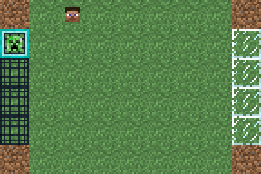

# Pygame Soccer

A variant of the game described in the paper [He, He, et al. "Opponent modeling in deep reinforcement learning." International Conference on Machine Learning. 2016][paper]. Pygame is used as the rendering framework. PyTMX is used to read the map file. Customized Minecraft texture is used for displaying the tiles.



Reinforcement learning agent controls the agent 1 (shown as the player Steve head), the computer agent controls the agent 2 (shown as the pig head). The agent who has the ball is bordered by a blue square (in this case, the player has the ball shown in the image).

When the player carries the ball to the rightmost goal field, a reward of 1.0 is given; When the computer carries the ball to the leftmost goal field, a reward of -1.0 is given. The episode ends when either one of the agent carries the ball to its goal field or the time step reaches 100. See the [paper][paper] for the game rules.

## Installation

## Requirements

- [Python 3.6](https://www.continuum.io/)

## Getting Started

1. Clone the repository.
2. Open a command line and change the working directory to the cloned directory.
3. Install the package in [editable](https://pip.pypa.io/en/stable/reference/pip_install/#editable-installs) mode because this package is not intended to be published.
```shell
pip install -e .
```

## Running the Samples

Run and see the sample files to get started.

* `sample/environment_simple.py`: For minimal setup.
* `sample/environment_advanced.py`: For advanced interaction with the environment.
* `sample/renderer.py`: For rendering with the default map.
* `sample/renderer_custom_map.py`: For rendering with the custom map.
* `sample/state_advanced.py`: For advanced state controlling.

### Changing the Map

The map data is embedded in the map file. For example, see `pygame_soccer/data/map/soccer.tmx`. Config file in the same directory is associated with layers regarding the name to positions mapping. See `pygame_soccer/renderer/pygame_renderer.py` for more information.

To modify the map, for example.

* Change the spawn field: Modify the layer `spawn_field` in `soccer.tmx`.
* Change the moving agents: Modify the layer `agent` in `soccer.tmx` and the mapping file `agent_sprite.yaml`.
* Change the goal field: Modify the layer `goal` in `soccer.tmx` and the mapping file `goal_tile.yaml`.
* Change the walkable field: Modify the layer `ground` in `soccer.tmx` and the mapping file `ground_tile.yaml`.

## Knowledge

### Computer Agent Algorithm

The computer agent has 4 strategies according to the scenarios described in the [paper][paper]. The internal algorithm of either approaching or avoiding is by randomly moving the direction in either axis so that the Euclidean distance from the target is shorter or further.

* "Avoid opponent": See where the nearest player is, avoid him.
* "Advance to goal": See where the leftmost goal field is, select a grid which has the maximum distance from the nearest player, approach it.
* "Defend goal": See where the rightmost goal field is, select a grid which has the minimum distance from the player who possesses the ball, approach it.
* "Intercept goal": See where the player who possesses the ball is, approach him.

The two agents move in random order, i.e., every time the player plans to moves, the computer agent either moves first or follows the move by the player.

## Development

### Software

* [Visual Studio Code](https://code.visualstudio.com/) for editing the text files.
* [Python extension for VSCode](https://marketplace.visualstudio.com/items?itemName=donjayamanne.python) for linting Python files.
* [Tiled Map Editor](http://www.mapeditor.org/) for editing `.tmx` and `.tsx` files.
* [GIMP](https://www.gimp.org/) for editing the image files.

### Running the Tests

1. Install the test dependencies.
```shell
pip install .[test]
```
2. Run the tests with Pytest.
```shell
python tests/main.py
```

### Resources

The materials of the tileset comes from the following links:

* [Minecraft Sprite](http://minecraft.gamepedia.com/index.php?title=File:BlockCSS.png)
* [Minecraft Pig Face Sprite](https://kandipatterns.com/patterns/characters/minecraft-pig-face-16x16-21979)

[paper]: https://www.umiacs.umd.edu/~hal/docs/daume16opponent.pdf