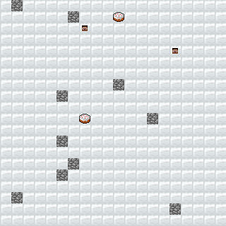

# Pygame RL

Some game environments used for reinforcement learning.

## Soccer

A variant of the game described in the paper [He, He, et al. "Opponent modeling in deep reinforcement learning." International Conference on Machine Learning. 2016](https://www.umiacs.umd.edu/~hal/docs/daume16opponent.pdf). Pygame is used as the rendering framework. PyTMX is used to read the map file. Customized Minecraft texture is used for displaying the tiles.


Reinforcement learning controls agent 1 (shown as the player Steve head), the computer controls agent 2 (shown as the pig head). The agent who has the ball is bordered by a blue square (in this case, the player has the ball shown in the image).

When the player carries the ball to the rightmost goal area, a reward of 1.0 is given; When the computer carries the ball to the leftmost goal area, a reward of -1.0 is given. The episode ends when either one of the agent carries the ball to its goal area or the time step reaches 100.

### Changing the Map

The map data is embedded in the map file. For example, see `pygame_rl/data/map/soccer/soccer.tmx`. Config file in the same directory is associated with layers regarding the name to positions mapping. See `pygame_rl/renderer/pygame_renderer.py` for more information.

To modify the map, for example:

* Change the spawn area: Modify the layer `spawn_area` in `soccer.tmx`.
* Change the moving agents: Modify the layer `agent` in `soccer.tmx` and the mapping file `agent_sprite.yaml`.
* Change the goal area: Modify the layer `goal` in `soccer.tmx` and the mapping file `goal_tile.yaml`.
* Change the walkable area: Modify the layer `ground` in `soccer.tmx` and the mapping file `ground_tile.yaml`.

### Computer Agent Algorithm

The computer agent has 4 strategies. The internal algorithm of either approaching or avoiding is by randomly moving the direction in either axis so that the Euclidean distance from the target is shorter or further. The defensive target is either the player who possesses the ball if one of the players has it or the nearest player if no players has the ball.

* "Avoid opponent": See where the nearest player is, avoid him.
* "Advance to goal": See where the leftmost goal area is, select a grid which has the maximum distance from the nearest player, approach it.
* "Defend goal": See where the rightmost goal area is, select a grid which has the minimum distance from the defensive target, approach it.
* "Intercept goal": See where the defensive target is, intercept him. It's basically approaching with an exception that the Euclidean distance is always greater than or equal to 1.

## Predator-Prey



There are fixed amount of predators (Steve head), preys (Cake) and obstacles (Cobblestone) on the field (Snow). Each agent can take five actions: moving to 4-direction grid points or standing still at each time step. Overlapping is only allowed when more than 1 predators and at least one prey intends to move to the same grid point.

Player can control part of predators and preys. Rule-based predators approach preys by finding the shortest path; Rule-based preys evade predators based on the directions and distances to predators. When a predator catches a prey, the prey disappears from the field, and a reward of 1.0 is given; A reward of 0.0 is given at all other time steps. The episode ends when there are no more preys or the time step reaches 100.

## Installation

### Requirements

* [Python 3.6](https://www.continuum.io/)

### Getting Started

1. Clone the repository.
2. Open a command line and change the working directory to the cloned directory.
3. Install the package in [editable](https://pip.pypa.io/en/stable/reference/pip_install/#editable-installs) mode because this package is not intended to be published.
    ```shell
    pip install -e .
    ```

### Running the Samples

Run and see the sample files in `sample/` to get started.

## Development

### Software

* [Visual Studio Code](https://code.visualstudio.com/) for editing the text files.
* [Python extension for VSCode](https://marketplace.visualstudio.com/items?itemName=donjayamanne.python) for debugging and linting Python files.
* [Tiled Map Editor](http://www.mapeditor.org/) for editing `.tmx` and `.tsx` files.
* [GIMP](https://www.gimp.org/) for editing the image files.

### Installing the Test Dependencies

1. Install the test dependencies.
    ```shell
    pip install -e .[test]
    ```

### Running the Tests

1. Run the tests with Pytest.
    ```shell
    pytest
    ```
2. Debug the tests with Python.
    ```shell
    python tests/main.py
    ```

### Measuring Code Coverage

1. Run the tests with Coverage.py.
    ```shell
    coverage run tests/main.py
    ```
2. Generate the web page report.
    ```shell
    coverage html
    ```
3. See the report in `htmlcov\index.html`.

### Measuring Performance

1. Run the sample with cProfile.
    ```shell
    python -m cProfile -o environment_advanced.prof sample/soccer/environment_advanced.py
    ```
2. See the report with SnakeViz.
    ```shell
    snakeviz environment_advanced.prof
    ```

### Resources

The materials of the tileset comes from the following links:

* [Minecraft Block Sprite](http://minecraft.gamepedia.com/index.php?title=File:BlockCSS.png)
* [Minecraft Entity Sprite](https://minecraft.gamepedia.com/index.php?title=File:EntityCSS.png)